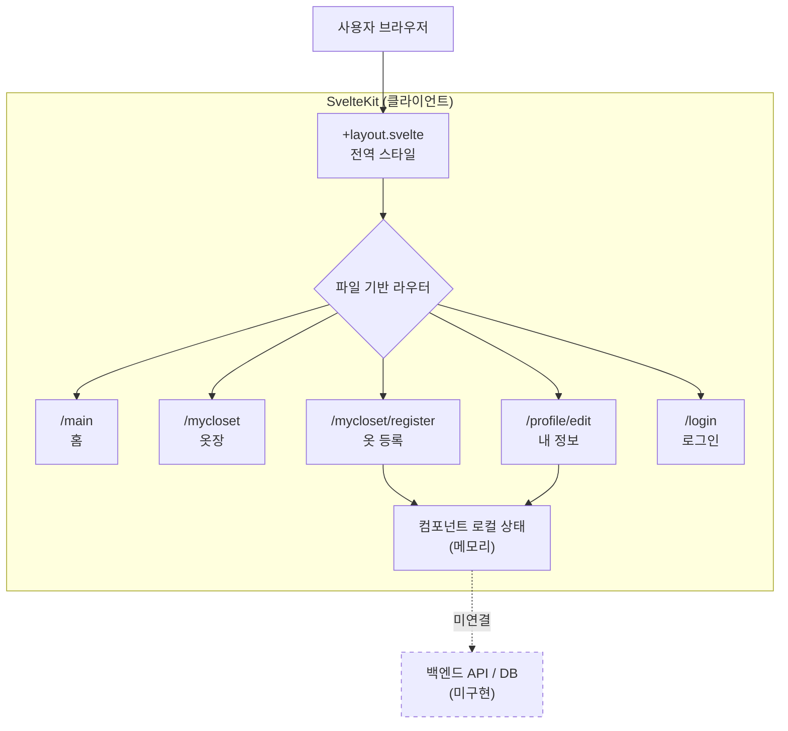
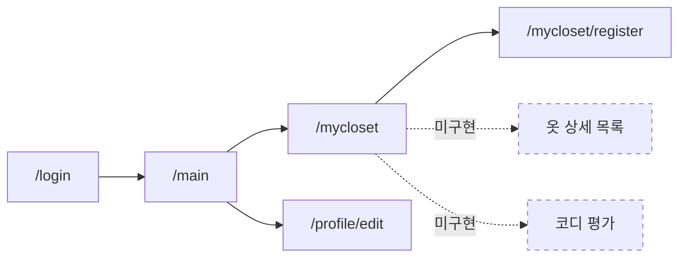

# MOIP-Z (Svelte)

> 옷장 관리와 코디 추천을 다루는 모바일 앱 MOIP-Z의 화면 설계를 SvelteKit으로 구현한 웹 프로토타입


---

## 목차

1. [소개](#1-소개)
2. [담당 역할](#2-담당-역할)
3. [주요 기능](#3-주요-기능)
4. [기술 스택](#4-기술-스택)
5. [시스템 아키텍처](#5-시스템-아키텍처)
6. [개발 환경 설정](#6-개발-환경-설정)
7. [실행](#7-실행)
8. [알려진 이슈](#8-알려진-이슈)
9. [향후 개발 방향](#9-향후-개발-방향)

---

## 1. 소개

MOIP-Z는 "오늘 뭐 입지?"라는 질문에서 출발한 옷장 관리 서비스다. 가지고 있는 옷을 등록해 두고, 사용자의 신체 정보와 취향을 기반으로 코디를 추천받는 것을 목표로 한다.

이 저장소는 그 서비스의 **화면 구조와 사용자 흐름을 먼저 검증하기 위한 웹 프로토타입**이다. 모든 화면은 클라이언트에서만 동작하며, 서버 API와 데이터베이스는 연결되어 있지 않다. 프로토타입으로 화면 구성을 확정한 뒤 모바일 구현체는 Flutter([MOIPZ-flutter](https://github.com/smj1746/MOIPZ-flutter))로 전환했고, 이 Svelte 버전은 웹 클라이언트로 이어서 개발할 여지를 남겨 두었다.

| 항목 | 내용 |
| --- | --- |
| 유형 | 개인 프로젝트 |
| 기간 | 2025.09 ~ 2025.12 |
| 팀 구성 | 1인 |
| 내 역할 | 프론트엔드 — 화면 구현 |
| 현재 단계 | UI 프로토타입 (정적 화면) |
| Repository | https://github.com/smj1746/MOIPZ-svelte |
| 관련 저장소 | https://github.com/smj1746/MOIPZ-flutter (모바일 구현체) |

---

## 2. 담당 역할

### 프론트엔드 — 화면 구현

1인 프로젝트이므로 저장소 내 모든 코드를 직접 작성했다. 다만 작업 범위 자체가 화면 구현에 한정되어 있다.

| 구분 | 담당 여부 | 비고 |
| --- | --- | --- |
| 페이지 라우팅 구성 | O | SvelteKit 파일 기반 라우팅 |
| 화면 마크업 / 스타일 | O | 순수 CSS, 프레임워크 미사용 |
| 폼 입력 상태 관리 | O | 컴포넌트 로컬 상태 (`bind:` 디렉티브) |
| 반응형 레이아웃 | O | 700px 기준 + 미디어 쿼리 |
| 백엔드 API | X | 미착수 |
| 데이터베이스 | X | 미착수 |
| 인증 / 세션 | X | 로그인 화면만 존재, 처리 로직 없음 |
| 배포 | X | 미착수 |

---

## 3. 주요 기능

구현 상태를 세 단계로 구분해 표기한다.

- **동작**: 클릭·입력에 반응하고 상태가 변경됨
- **화면만**: 마크업과 스타일은 완성, 이벤트 처리 없음
- **미구현**: 진입 경로만 있고 대상 페이지가 없음

### 3-1. 라우트 구성

| 경로 | 파일 | 설명 | 상태 |
| --- | --- | --- | --- |
| `/` | `routes/+page.svelte` | 초기 레이아웃 골격 | 화면만 |
| `/login` | `routes/login/+page.svelte` | 로그인 폼 | 화면만 |
| `/main` | `routes/main/+page.svelte` | 홈 — 공지, 추천 코디, 기능 그리드 | 화면만 |
| `/mycloset` | `routes/mycloset/+page.svelte` | 나만의 옷장 진입 화면 | 동작 |
| `/mycloset/register` | `routes/mycloset/register/+page.svelte` | 새 옷 등록 | 동작 |
| `/profile/edit` | `routes/profile/edit/+page.svelte` | 내 정보 입력 | 동작 |
| `/about` | `routes/(tmp)/about/+page.svelte` | SvelteKit 생성 템플릿 페이지 | 화면만 |

### 3-2. 새 옷 등록 (`/mycloset/register`)

옷 한 벌의 정보를 입력받는 폼이다. 입력값은 컴포넌트 상태에만 보관되며, 등록 버튼은 콘솔 출력과 알림까지 수행한다.

| 입력 항목 | 컨트롤 | 동작 |
| --- | --- | --- |
| 사진 | 파일 선택 | `FileReader`로 Data URL 변환 후 미리보기 표시 |
| 카테고리 | 셀렉트 (7종) | `bind:value` |
| 브랜드 | 텍스트 | `bind:value` |
| 색상 | 색상 버튼 8종 | 단일 선택, 선택 시 테두리 강조 |
| 시즌 | 버튼 4종 | 다중 선택 토글 |
| 가격 / 구매일 | 숫자, 날짜 | `bind:value` |
| 메모 | 텍스트영역 | `bind:value` |

### 3-3. 내 정보 입력 (`/profile/edit`)

코디 추천에 사용할 사용자 정보를 입력받는 폼이다. 구성은 4개 섹션으로 나뉜다.

| 섹션 | 입력 항목 | 동작 |
| --- | --- | --- |
| 프로필 사진 | 이미지 업로드 | `FileReader` 미리보기 |
| 기본 정보 | 닉네임, 성별(단일 선택), 생년월일 | `bind:value` / 버튼 토글 |
| 신체 정보 | 키, 몸무게, 체형, 선호 핏(다중 선택) | `bind:value` / 버튼 토글 |
| 스타일 정보 | 선호 스타일 8종, 선호 색상 10종, 예산 | 다중 선택 토글 |
| 관심 정보 | 자유 입력, 알림 설정 3종 | `bind:value` / `bind:checked` |

### 3-4. 나만의 옷장 (`/mycloset`)

옷장을 형상화한 화면이다. 상단에 `내 코디 평가`와 `새 옷 등록` 진입 버튼을 두고, 중앙 옷장 영역을 클릭하면 상세 목록으로 이동하도록 설계했다.

| 요소 | 이동 대상 | 상태 |
| --- | --- | --- |
| 새 옷 등록 | `/mycloset/register` | 동작 |
| 내 코디 평가 | — | 미구현 |
| 옷장 영역 클릭 | 옷 상세 목록 | 미구현 (핸들러에 TODO 주석) |

### 3-5. 공통 레이아웃

모든 페이지가 동일한 골격을 공유한다. 현재는 컴포넌트로 분리하지 않고 각 페이지에 같은 마크업을 반복 작성한 상태다.

- 상단 헤더 (메뉴 / 서비스명 / 더보기)
- 검색 바
- 하단 고정 내비게이션 (5개 탭)
- 내비게이션 바로 위 로고 배너와 슬로건

---

## 4. 기술 스택

| 구분 | 사용 기술 | 선택 이유 |
| --- | --- | --- |
| 프레임워크 | SvelteKit 2.39 | 파일 기반 라우팅으로 화면 수가 늘어도 구조 파악이 쉬움. 프로토타입 단계에서 라우트 추가 비용이 낮다 |
| UI 라이브러리 | Svelte 5.38 | 가상 DOM 없이 컴파일 시점에 갱신 코드를 생성해 런타임 크기가 작음. `bind:`, `class:` 디렉티브로 폼 상태 처리 코드가 짧아짐 |
| 언어 | TypeScript 5.9 | 폼 상태와 이벤트 핸들러의 타입을 고정해, 화면 수가 늘어날 때 발생하는 오타·누락을 컴파일 단계에서 확인 |
| 빌드 도구 | Vite 7.1 | SvelteKit 기본 번들러. HMR 반영이 빨라 화면 스타일을 반복 수정하는 작업에 적합 |
| 스타일 | 순수 CSS (컴포넌트 스코프) | Svelte의 스타일 스코핑으로 클래스명 충돌이 없어, 프로토타입 단계에서 CSS 프레임워크 도입 없이 진행 |
| 어댑터 | `@sveltejs/adapter-auto` | 배포 대상을 확정하지 않은 단계라 기본값 유지 |

---

## 5. 시스템 아키텍처

### 5-1. 현재 구조

서버 사이드 로직 없이 브라우저에서만 동작한다.



### 5-2. 화면 이동 흐름



### 5-3. 계층별 책임

| 계층 | 파일 | 책임 |
| --- | --- | --- |
| 전역 레이아웃 | `src/routes/+layout.svelte` | 전역 리셋, 폰트, `box-sizing` 설정 |
| 라우트 페이지 | `src/routes/**/+page.svelte` | 마크업, 스코프 CSS, 로컬 상태, 이벤트 핸들러 |
| 정적 자산 | `static/` | favicon, robots.txt |
| 앱 셸 | `src/app.html` | HTML 진입점 |
| 전역 스타일 | `src/app.css` | CSS 변수, 기본 타이포그래피 |
| 타입 선언 | `src/app.d.ts` | SvelteKit 앰비언트 타입 |

현재 각 페이지가 마크업·스타일·상태를 모두 가지고 있어, 계층 분리는 라우트 단위까지만 이루어져 있다.

### 5-4. 디렉터리 구조

```
MOIPZ-svelte/
├── src/
│   ├── app.css                          # 전역 스타일, CSS 변수
│   ├── app.d.ts                         # SvelteKit 타입 선언
│   ├── app.html                         # HTML 진입점
│   └── routes/
│       ├── +layout.svelte               # 전역 레이아웃
│       ├── +page.svelte                 # /
│       ├── (tmp)/
│       │   └── about/+page.svelte       # /about (템플릿 잔여)
│       ├── login/+page.svelte           # /login
│       ├── main/
│       │   ├── +page.css                # (빈 파일)
│       │   └── +page.svelte             # /main
│       ├── mycloset/
│       │   ├── +page.svelte             # /mycloset
│       │   └── register/+page.svelte    # /mycloset/register
│       └── profile/
│           └── edit/+page.svelte        # /profile/edit
├── static/
│   ├── favicon.svg
│   └── robots.txt
├── .npmrc                               # engine-strict=true
├── package.json
├── svelte.config.js
├── tsconfig.json
└── vite.config.ts
```

---

## 6. 개발 환경 설정

### 6-1. 요구 사항

`.npmrc`에 `engine-strict=true`가 설정되어 있어, 아래 버전 조건을 만족하지 않으면 설치가 중단된다.

| 항목 | 버전 | 근거 |
| --- | --- | --- |
| Node.js | `^20.19` \|\| `^22.12` \|\| `>=24` | `@sveltejs/vite-plugin-svelte` 6.x engines |
| npm | `>=8.0.0` | `rollup` 4.x engines |

```bash
node -v
npm -v
```

### 6-2. 설치

```bash
git clone https://github.com/smj1746/MOIPZ-svelte.git
cd MOIPZ-svelte
npm install
```

`npm install` 시 `prepare` 스크립트가 `svelte-kit sync`를 실행해 `.svelte-kit/` 디렉터리와 타입 정의를 생성한다. 편집기에서 타입 오류가 사라지지 않으면 다음을 직접 실행한다.

```bash
npx svelte-kit sync
```

### 6-3. 환경 변수

현재 외부 서비스 연동이 없어 필요한 환경 변수가 없다. 백엔드를 연결하는 시점에 다음 형태로 `.env`를 추가할 예정이다.

```bash
# .env.example (예정 — 현재 코드에서는 사용하지 않음)
PUBLIC_API_BASE_URL=http://localhost:3000
```

`.gitignore`에 `.env`, `.env.*`가 이미 등록되어 있으며 `.env.example`은 예외 처리되어 있다.

---

## 7. 실행

### 7-1. 명령어

| 명령어 | 설명 |
| --- | --- |
| `npm run dev` | 개발 서버 실행 |
| `npm run dev -- --open` | 개발 서버 실행 후 브라우저 자동 열기 |
| `npm run build` | 프로덕션 빌드 |
| `npm run preview` | 빌드 결과 미리보기 |
| `npm run check` | `svelte-check` 타입 검사 1회 실행 |
| `npm run check:watch` | 타입 검사 watch 모드 |

### 7-2. 접속 주소

| 화면 | 주소 |
| --- | --- |
| 초기 화면 | http://localhost:5173/ |
| 로그인 | http://localhost:5173/login |
| 홈 | http://localhost:5173/main |
| 나만의 옷장 | http://localhost:5173/mycloset |
| 새 옷 등록 | http://localhost:5173/mycloset/register |
| 내 정보 입력 | http://localhost:5173/profile/edit |

포트가 사용 중이면 Vite가 5174 이후 번호로 자동 변경한다.

### 7-3. 테스트

자동화된 테스트 코드와 테스트 러너는 도입하지 않았다. `package.json`에 `test` 스크립트가 없다. 현재 검증 수단은 타입 검사와 브라우저 수동 확인 두 가지다.

```bash
npm run check
```

---

## 8. 알려진 이슈

| # | 항목 | 내용 |
| --- | --- | --- |
| 1 | 홈 화면 라우트 이원화 | 루트 `/`와 `/main`이 각각 별도의 홈 화면 마크업을 가지고 있다. 초기에 `/`에 골격을 작성한 뒤 `/main`에 본 구현을 진행했고, 루트 파일을 정리하지 않은 상태다 |
| 2 | 공통 UI 중복 | 헤더, 검색 바, 로고 배너, 하단 내비게이션이 6개 페이지에 각각 복사되어 있다. `src/lib/`을 사용하지 않아 공유 컴포넌트가 없다 |
| 3 | 상태 비영속 | 입력값이 컴포넌트 로컬 변수에만 저장되어 페이지 이동이나 새로고침 시 초기화된다 |
| 4 | 저장 로직 미연결 | 등록·저장 버튼의 핸들러가 `console.log`와 `alert`까지만 수행하고, 이후 처리 지점에 TODO 주석이 남아 있다 |
| 5 | 미연결 진입점 | `/mycloset`의 옷장 영역과 `내 코디 평가` 버튼에 클릭 핸들러가 있으나 이동 대상 라우트가 아직 없다 |
| 6 | 템플릿 잔여 파일 | `(tmp)/about`은 `npx sv create`가 생성한 예제 페이지이며, 서비스 화면이 아니다. `main/+page.css`는 빈 파일 상태다 |
| 7 | 사용되지 않는 의존성 | `@anthropic-ai/claude-agent-sdk`가 `dependencies`에 등록되어 있으나 라우트 코드에서 import하지 않는다 |
| 8 | 반응형 검증 범위 | 컨테이너 폭을 700px로 고정하고 768px 미디어 쿼리에서 400px로 전환한다. 그 사이 구간과 실제 단말 뷰포트는 확인하지 않았다 |
| 9 | 테스트 부재 | 자동화 테스트가 없어 회귀 여부를 코드로 확인할 수 없다 |
| 10 | 인증 미구현 | 로그인 폼에 제출 핸들러가 없어 입력 후 아무 동작도 일어나지 않는다 |

---

## 9. 향후 개발 방향

### 우선순위 1 — 구조 정리

| 과제 | 내용 |
| --- | --- |
| 공통 컴포넌트 추출 | 헤더·검색 바·로고 배너·하단 내비게이션을 `src/lib/components/`로 분리하고 `+layout.svelte`에서 조합. 이슈 2 해소 |
| 라우트 정리 | 루트 `/`를 `/main` 리디렉트 또는 랜딩으로 정리하고, `(tmp)` 그룹과 빈 CSS 파일 제거. 이슈 1·6 해소 |
| 내비게이션 활성 상태 연동 | `$page.url.pathname`으로 현재 탭을 자동 판별해, 페이지마다 `active` 클래스를 직접 지정하는 방식을 대체 |

### 우선순위 2 — 데이터 흐름

| 과제 | 내용 |
| --- | --- |
| 전역 스토어 도입 | Svelte store로 옷장·프로필 상태를 분리하고 `localStorage`에 영속화. 이슈 3 해소 |
| 도메인 타입 정의 | `ClothingItem`, `UserProfile` 인터페이스를 `src/lib/types/`에 정의해 화면 간 데이터 계약 고정 |
| 폼 유효성 검사 | 필수 항목 검증과 오류 메시지 표시 추가 |

### 우선순위 3 — 화면 확장

| 과제 | 내용 |
| --- | --- |
| 옷 상세 목록 | `/mycloset/items` 신설. 카테고리·색상·시즌 필터와 그리드 뷰 제공. 이슈 5 해소 |
| 코디 평가 화면 | `/mycloset/review` 신설 |
| 코디 추천 화면 | 날씨 정보와 사용자 선호를 입력으로 받는 추천 결과 화면 |

### 우선순위 4 — 백엔드 연동

| 과제 | 내용 |
| --- | --- |
| API 계층 분리 | `src/lib/api/`에 fetch 래퍼를 두고, 스토어가 직접 API를 호출하지 않도록 경계 설정 |
| 서버 구축 | 옷장 CRUD와 이미지 업로드를 담당하는 서버 도입. Flutter 클라이언트와 동일한 API를 공유하는 구성을 검토 |
| 인증 | 로그인 폼에 실제 인증 흐름 연결. 이슈 10 해소 |

### 우선순위 5 — 품질

| 과제 | 내용 |
| --- | --- |
| 테스트 도입 | Vitest로 스토어 로직 단위 테스트, Playwright로 주요 화면 이동 시나리오 검증. 이슈 9 해소 |
| 반응형 재정비 | 모바일 우선으로 브레이크포인트를 재설계하고 실제 단말에서 확인. 이슈 8 해소 |
| 접근성 | `svelte-check`의 a11y 경고를 0으로 유지하고 키보드 내비게이션 경로 확인 |
| 배포 | 어댑터를 배포 대상에 맞게 교체하고 프리뷰 환경 구성 |

---

## License

MIT
